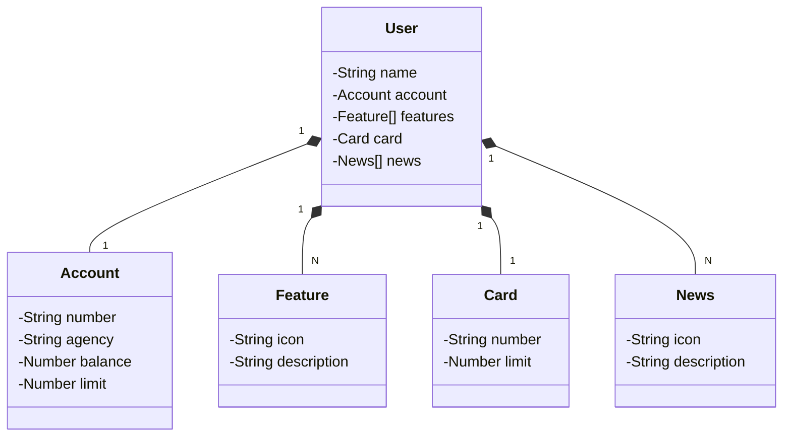

### Java RESTful API criada para a Decola Tech da DIO.

### Principais Tecnologias
 - **Java 23**;
 - **Spring Boot 3.4.3**;
 - **Spring Data JPA**;
 - **OpenAPI (Swagger)**;
 - **Railway**
 - 
### Diagrama de Classes (Domínio da API)

