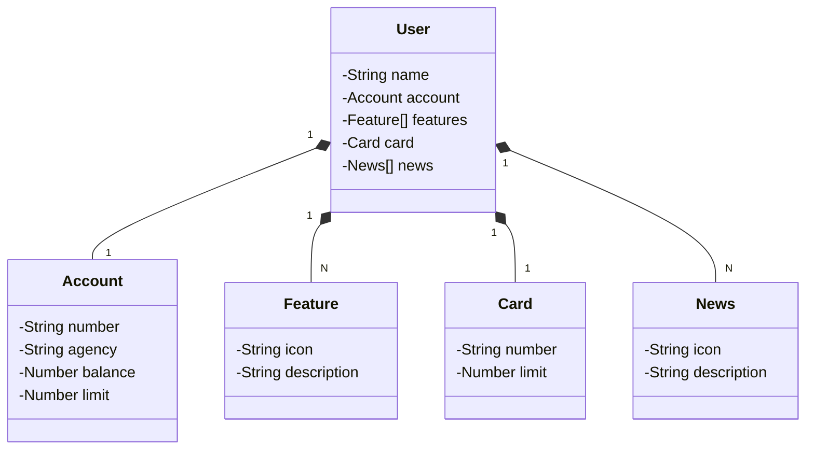

### Java RESTful API com deploy no Railway
Este projeto é uma API RESTful desenvolvida em Java e Spring Boot, com persistência de dados utilizando Spring Data JPA e documentação via Swagger (OpenAPI). O deploy da API é realizado na plataforma Railway.

### Principais Tecnologias
 - **Java 17**;
 - **Spring Boot 3.4.3**;
 - **Spring Data JPA**;
 - **OpenAPI (Swagger)**;
 - **Railway**

### Sobre a API
A API permite o gerenciamento de usuários, contas bancárias, cartões e funcionalidades associadas. A seguir, um diagrama de classes representando o domínio do sistema.

### Diagrama de Classes (Domínio da API)


```mermaid
classDiagram
  class User {
    -String name
    -Account account
    -Feature[] features
    -Card card
    -News[] news
  }

  class Account {
    -String number
    -String agency
    -Number balance
    -Number limit
  }

  class Feature {
    -String icon
    -String description
  }

  class Card {
    -String number
    -Number limit
  }

  class News {
    -String icon
    -String description
  }

  User "1" *-- "1" Account
  User "1" *-- "N" Feature
  User "1" *-- "1" Card
  User "1" *-- "N" News
```

### Deploy no Railway  

A API est√° hospedada no Railway. Para acessar, utilize:  
```
vibrant-clarity-production.up.railway.app
```  

## üìå Endpoints Principais  

| Método | Endpoint         | Descrição                           |
|--------|----------------|-----------------------------------|
| `GET`  | `/users`       | Retorna todos os usu√°rios        |
| `POST` | `/users`       | Cria um novo usu√°rio             |
| `GET`  | `/accounts`    | Retorna todas as contas          |
| `POST` | `/accounts`    | Cria uma nova conta              |
